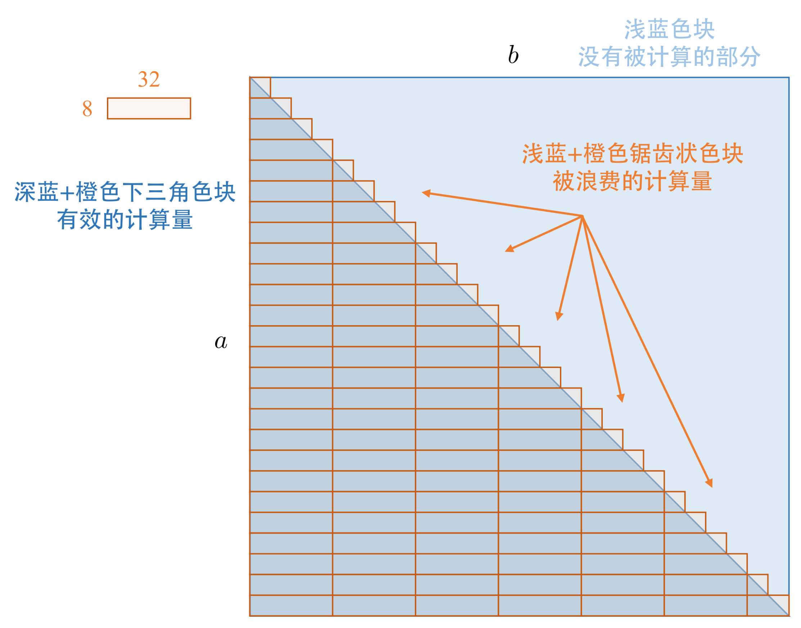

# RI-RCCSD：高效率实现

- 程序：`ri_rccsd.rs` ([gitee](https://gitee.com/restgroup/showcase-workshop-rstsr-ricc/blob/master/src/ri_rccsd.rs), [github](https://github.com/RESTGroup/showcase-workshop-rstsr-ricc/blob/master/src/ri_rccsd.rs))
- 实现内容：RI-RCCSD (restricted resolution-of-identity coupled-cluster (singles and doubles))
- 性能较高
    - 体系 (H2O)<sub>10</sub> cc-pVDZ ($n_\mathrm{basis} = 240$, $n_\mathrm{aux} = 840$，无冻结轨道)
    - 计算设备 Ryzen HX7945，16 cores，算力约 1.1 TFLOP/sec
    - 一次 CCSD 迭代约 24.0 sec，CPU 性能利用率约 49%
    - 本文档的所有性能分析均基于 OpenBLAS 后端讨论
- 该程序总共约 700 行
- 该程序包含 DIIS 迭代
- 程序测评脚本
    ```bash
    cargo build --release --features="use_openblas"
    target/release/showcase-workshop-rstsr-ricc ri-rccsd \
        -mol assets/h2o_10-pvdz.json -aux assets/h2o_10-pvdz_jk.json --aux-ri assets/h2o_10-pvdz_ri.json
    ```

## 目录

<!-- toc -->

## 1. RI-RCCSD 实现前言

相比于 RHF、RI-RHF、RI-CCSD(T) 的 triplet 微扰部分都只有 100 行左右，RI-RCCSD 的 600 行程序长度有明显的提升。这其中直接的原因是
- RI-RCCSD 本身的公式数量相当多；
- 需要用工程化的思路组织程序，这引入了许多不执行具体计算的业务逻辑代码 (大量的 getter/setter)；
- 为了提升效率，一些情况下我们确实需要引入更多的代码；
- RSTSR 目前暂不支持 einsum 式的张量缩并[^1]，因此需要用矩阵乘法实现张量缩并。

如果从提升实现效率的角度而言，还有额外的原因是
- 为了将张量缩并问题化为矩阵乘法，我们需要经常思考如何排布张量的指标顺序[^2]。因此，公式推导和程序的实现复杂程度还会进一步提升。

[^1]: 考虑到 einsum 对程序快速实现的重要性，RSTSR 未来将会实现 einsum。
[^2]: 即使能使用 einsum 作缩并，张量的指标排布顺序对于程序运行效率的提升仍然是重要的。可以直接划归为矩阵乘法的 einsum 才能达到最高的效率，其他情形的 einsum 一般都会对性能有一定程度的损失。

但相对于 RI-RCCSD(T) 的 triplet 微扰，RI-RCCSD 相对来说更简单的部分是
- 绝大多数计算都可以用数学库的标准函数高效实现，不需要作额外的 hack。

---

我们知道耦合簇方法，从公式上，可以认为是联立下述关于波函数态 $\xi$ 方程组，求解 $\hat T = \sum_{\xi} t_\xi \hat \xi$ 中的激发系数 $t_\xi$：
$$
\langle \Phi_\xi | e^{- \hat T} \hat H e^{\hat T} | \Phi_0 \rangle = \delta_{\xi 0} E^\textsf{CC}
$$
其中，
- $\hat H$ 是体系 Hamiltonian，
- $| \Phi_0 \rangle$ 是参考基态 (一般是 Hartree-Fock 基态)，
- $| \Phi_\xi \rangle = \hat \xi | \Phi_0 \rangle$ 是参考方法能级为 $\xi$ 的态波函数。$\hat \xi$ 这里指代激发算符；在二次量子化下，一次激发 $| \Phi_i^a \rangle = i^\dagger a | \Phi_0 \rangle$，二次激发 $| \Phi_{ij}^{ab} \rangle = i^\dagger j^\dagger b a | \Phi_0 \rangle$。

上式的 $\hat T$ 原则上应该包含任意阶次的激发算符 (最多到参考态占据电子数)，但大多数时候 $\hat T$ 截断到 2-3 次激发就达到一般化学需求 (或者达到可计算能力上限)。当 $\hat T$ 截断到二次激发时，称为 CCSD 方法；进一步通过引入 $\hat T$ 的特定三次微扰时，则称为 CCSD(T) 方法。

耦合簇理论很优美，但程序的实现没办法做得这么漂亮。即使是概述 RI-RCCSD 的实现，也不可避免地涉及大量公式细节[^3]。因此，这一节中，我们会拆解 RI-RCCSD 到数个子任务，对每个子任务进行公式、程序实现、以及性能提升策略的叙述。

[^3]: 感兴趣的读者可以参考下述程序的实现文献：[Q-Chem](https://dx.doi.org/10.1063/1.4820484), [Psi4 fnocc](https://dx.doi.org/10.1021/ct400250u), [FHI-Aims](https://dx.doi.org/10.1021/acs.jctc.8b01294), [Gamess US](https://dx.doi.org/10.1021/acs.jctc.1c00389)。

## 2. Cholesky 分解积分

- 程序函数：`get_riccsd_intermediates_cderi`

### 2.1 公式

与 RI-RHF 的情形不同，在 RI-RCCSD 计算时，我们希望辅助基指标在最连续的维度上，且我们希望得到分子轨道基下的 Cholesky 分解积分：

$$
B_{pq, P} = \sum_{\mu \nu} B_{\mu \nu, P} C_{\mu p} C_{\nu q}
$$

| 变量名 | 公式表达 | 指标 | 维度 |
|--|--|--|--|
| `b_oo` | $B_{ij, P}$ | $(i, j, P)$ | $(n_\mathrm{occ}, n_\mathrm{occ}, n_\mathrm{aux})$ |
| `b_ov` | $B_{ia, P}$ | $(i, a, P)$ | $(n_\mathrm{occ}, n_\mathrm{vir}, n_\mathrm{aux})$ |
| `b_vv` | $B_{ab, P}$ | $(a, b, P)$ | $(n_\mathrm{vir}, n_\mathrm{vir}, n_\mathrm{aux})$ |

### 2.2 程序

下述程序从分子基组信息开始，
- 首先获得原子轨道基下的 2c-2e 双电子积分 $g_{PQ}$ 与 row-major 的 3c-2e 双电子积分 $g_{\mu \nu, P}$；
    ```rust
    let int3c2e = util::intor_3c2e_row_major(cint_data, aux_cint_data, "int3c2e");
    let int2c2e = util::intor_row_major(aux_cint_data, "int2c2e");
    ```
- 对原子轨道基下的积分作转换，得到 Cholesky 分解积分 $B_{\mu \nu, P}$，
    ```rust
    let int3c2e_trans = int3c2e.into_shape([nao * nao, naux]).into_reverse_axes();
    let int2c2e_l = rt::linalg::cholesky((int2c2e.view(), Lower));
    let cderi = rt::linalg::solve_triangular((int2c2e_l.view(), int3c2e_trans, Lower));
    let cderi_uvp = cderi.into_reverse_axes().into_shape([nao, nao, naux]);
    ```
- 作第一次半转换得到 $B_{p \nu, P}$：
    $$
    B_{p \nu, P} \equiv B_{p, \nu P} = \sum_\mu C_{\mu p} B_{\mu, \nu P}
    $$
    ```rust
    let cderi_svp = (mo_coeff.t() % cderi_uvp.reshape((nao, nao * naux))).into_shape((nmo, nao, naux));
    ```
- 对三种情形分别作第二次半转换，得到最终的分子轨道基下的 Cholesky 分解积分；下述计算利用了 RSTSR 所支持的 broadcast 矩阵乘法：
    $$
    \begin{aligned}
    B_{ij, P} \equiv B_{i, jP} &= \sum_\nu C_{\square, \nu j} B_{i, \nu P} \\
    B_{ia, P} \equiv B_{i, aP} &= \sum_\nu C_{\square, \nu a} B_{i, \nu P} \\
    B_{ab, P} \equiv B_{a, bP} &= \sum_\nu C_{\square, \nu b} B_{a, \nu P}
    \end{aligned}
    $$
    ```rust
    let so = slice!(0, nocc);
    let sv = slice!(nocc, nocc + nvir);
    let b_oo = mo_coeff.i((.., so)).t() % cderi_svp.i(so);
    let b_ov = mo_coeff.i((.., sv)).t() % cderi_svp.i(so);
    let b_vv = mo_coeff.i((.., sv)).t() % cderi_svp.i(sv);
    ```

### 2.3 性能上的考量

1. 与 RI-RHF 实现不同，3c-2e 双电子积分我们要求使用 row-major 的版本得到 $g_{\mu \nu, P}$，而不是使用 col-major 的版本再作一次转置得到 $g_{P, \mu \nu}$。这是因为 RI-RCCSD 的许多计算中，辅助基 $P$ 是最连续的维度会比较方便。那么不论是 3c-2e 电子积分还是 Cholesky 分解积分，我们都要求辅助基指标 $P$ 是最连续的。

2. `rt::linalg::solve_triangular` 支持 inplace solve (上述代码的 `cderi` 复用了 `int3c2e_trans` 的内存数据，效率更高)，因此对 `int3c2e` $g_{\mu \nu, P}$ 的维度更改操作，始终使用 `into_` 函数 (输入输出都是占据数据的张量)，而不是使用视窗。

3. 我们需要存储三个分子轨道基 Cholesky 分解积分 $B_{ij, P}$、$B_{ia, P}$、$B_{ab, P}$。一个自然的疑问是，为什么我们不存储完整的分子轨道空间积分 $B_{pq, P}$？这会牺牲不是很多的内存，但可以减少程序用到的变量数量，简化程序编写。

    但考虑到后续的计算过程中，经常要作 reshape 维度更改 (譬如 $B_{ij, P} \equiv B_{i, jP}$)。而维度更改要求了数据的连续性 (该例子中，如果要求维度更改不会产生新的内存，$i$ 与 $j$ 指标未必是连续的，但 $j$ 和 $P$ 之间必须是连续的)。
    
    这意味着，如果存储为 row-major 连续的 $B_{ij, P}$，那么取 $B_{i, jP}$ 时是不会发生内存复制的：
    ```rust
    b_oo.reshape((nocc, nocc * naux)) // DataCow::Ref, data not cloned
    ```
    如果存储为 $B_{pq, P}$、而在用到子张量 $B_{i, jP}$ 时使用索引加 reshape，是**会发生内存复制的**：
    ```rust
    b_all.i((so, so, ..)).reshape((nocc, nocc * naux)) // DataCow::Owned, data cloned
    ```
    考虑到 $B_{ij, P}$ 到 $B_{i, jP}$ 这类 reshape 经常会用到，我们不能只存一个变量 $B_{pq, P}$ 而需要分开存三个，为运行效率对代码复杂度作妥协。

### 3.4 性能评价

| 计算过程 | FLOPs 解析式 | FLOPs 实际数值 | 计算耗时 |
|--|--|--|--|
| 3c-2e/2c-2e 双电子积分 | | | 85 msec |
| Cholesky 分解积分 | $\frac{1}{3} n_\mathrm{aux}^3 + n_\mathrm{basis}^2 n_\mathrm{aux}^2$ | 38.0 GFLOPs | 85 msec |
| 原子轨道到分子轨道变换 | $4 n_\mathrm{basis}^3 n_\mathrm{aux} - 2 n_\mathrm{occ} n_\mathrm{vir} n_\mathrm{basis} n_\mathrm{aux}$ | 39.7 GFLOPs | 250 msec |

- Cholesky 分解积分的浮点效率是 0.45 TFLOP/sec，性能利用率 40%，其性能是比较高的；
- 原子轨道到分子轨道变换的浮点效率是 0.16 TFLOP/sec，性能利用率 14%，该步骤性能有待改进；但考虑到 CCSD 中分子轨道变换占总计算消耗很少，因此仅针对当前任务，不是非常有必要对该过程进一步优化：
    - 上述计算过程没有利用电子积分的对称性，内存利用上有少许提升空间；
    - 上述代码的实现较为简洁，但诸如 `cderi_svp` 等中间张量其实是可以避免生成、从而避免较大的内存带宽消耗。原子轨道到分子轨道变换的性能有进一步提升的空间。

## 3. RCCSD 初猜与 RI-RMP2 能量

- 程序函数：`get_riccsd_initial_guess`
- 输出类型：`RCCSDResults`

CCSD 的初猜一般是 MP2 的激发振幅；在真正开始 CCSD 计算前，由于 MP2 能量计算并不额外消耗太多计算资源，因此 RI-RMP2 能量可以顺便给出。

### 3.1 输出类型 `RCCSDResults`

```rust
pub struct RCCSDResults {
    pub e_corr: f64,
    pub t1: Tsr,
    pub t2: Tsr,
}
```

| 变量名 | 公式表达 | 指标 | 维度 |
|--|--|--|--|
| `t1`     | $t_i^a$       | $(i, a)$       | $(n_\mathrm{occ}, n_\mathrm{vir})$                                 |
| `t2`     | $t_{ij}^{ab}$ | $(i, j, a, b)$ | $(n_\mathrm{occ}, n_\mathrm{occ}, n_\mathrm{vir}, n_\mathrm{vir})$ |
| `e_corr` | $\Delta E^\mathsf{SD}$ | | scalar |

上表中，$\Delta E^\mathsf{SD}$ 是指 CCSD 的相关能；只有与 Hartree-Fock 参考态能量求和，才得到完整的 CCSD 体系能量。

### 3.2 公式

首先，为计算 MP2 的二次激发张量 $t_{ij}^{ab} {}^{(2)}$，需要获得分子轨道下的 4c-2e 双电子积分 $g_{ij}^{ab}$，求得多体微扰分母 $\Delta_{ij}^{ab}$：
$$
\begin{aligned}
g_{ij}^{ab} &= \sum_P B_{ia, P} B_{jb, P} \\
\Delta_{ij}^{ab} &= \varepsilon_i + \varepsilon_j - \varepsilon_a - \varepsilon_b \\
t_{ij}^{ab} {}^\textsf{(2)} &= g_{ij}^{ab} / \Delta_{ij}^{ab}
\end{aligned}
$$

随后可以计算 MP2 能量 (下式的 OS 表示 opposite-spin、SS 表示 same-spin，bi1 与 bi2 表示闭壳层 bi-orthogonal 下的两个分量)：
$$
\begin{aligned}
\Delta E^\textsf{bi1} &= \sum_{ijab} t_{ij}^{ab} {}^\textsf{(2)} g_{ij}^{ab} \\
\Delta E^\textsf{bi2} &= \sum_{ijab} t_{ij}^{ab} {}^\textsf{(2)} g_{ij}^{ba} \\
\Delta E^\textsf{(2)-OS} &= \Delta E^\textsf{bi1} \\
\Delta E^\textsf{(2)-SS} &= \Delta E^\textsf{bi1} - \Delta E^\textsf{bi2} \\
\Delta E^\textsf{(2)} &= \Delta E^\textsf{(2)-OS} + \Delta E^\textsf{(2)-SS}
\end{aligned}
$$

### 3.3 程序

MP2 的激发张量与能量可以在 3-5 行公式内写出，意味着程序也可以在 3-5 行代码 (或 3-5 个 statement) 实现 (下述代码片段中张量的指标顺序是 $(i,a,j,b)$，与正文其他部分不同)：
```rust
let g2 = b_ov.reshape((nocc * nvir, -1)) % b_ov.reshape((nocc * nvir, -1)).t();
let g2 = g2.into_shape((nocc, nvir, nocc, nvir));
let d2 = mo_energy.i((so, None, None, None))
    - mo_energy.i((None, sv, None, None))
    + mo_energy.i((None, None, so, None))
    - mo_energy.i((None, None, None, sv));
let t2 = &g2 / &d2;
let e_corr_mp2 = ((2.0_f64 * &t2 - t2.swapaxes(1, 3)) * &g2).sum();
```

这段程序尽管非常直观短小，但计算量与内存消耗都较大。实际运行的程序是

```rust
let d_ov = mo_energy.i((so, None)) - mo_energy.i((None, sv));
let t1 = rt::zeros(([nocc, nvir], &device));
let t2 = rt::zeros(([nocc, nocc, nvir, nvir], &device));

let e_corr_oo = rt::zeros(([nocc, nocc], &device));
(0..nocc).into_par_iter().for_each(|i| {
    (0..i + 1).into_par_iter().for_each(|j| {
        let g2_ab = b_ov.i(i) % b_ov.i(j).t();
        let d2_ab = d_ov.i((i, .., None)) + d_ov.i((j, None, ..));
        let t2_ab = &g2_ab / &d2_ab;
        let mut t2 = unsafe { t2.force_mut() };
        t2.i_mut((i, j)).assign(&t2_ab);
        if i != j {
            t2.i_mut((j, i)).assign(&t2_ab.t());
        }
        let e_bi1 = (&t2_ab * &g2_ab).sum_all();
        let e_bi2 = (&t2_ab * &g2_ab.swapaxes(-1, -2)).sum_all();
        let e_corr_ij = 2.0 * e_bi1 - e_bi2;
        let mut e_corr_oo = unsafe { e_corr_oo.force_mut() };
        *e_corr_oo.index_mut([i, j]) = e_corr_ij;
        *e_corr_oo.index_mut([j, i]) = e_corr_ij;
    });
});

let e_corr = e_corr_oo.sum_all();
```

上述代码可以利用输出张量 $t_{ij}^{ab} = t_{ji}^{ba}$ 的对称性，从而只对 $i \geqslant j$ 的下三角情形作计算；而上三角的部分复制下三角的部分即可，减少一半计算量。

### 3.4 性能评价

| 计算过程 | FLOPs 解析式 | FLOPs 实际数值 |
|--|--|--|
| $g_{ij}^{ab} = \sum_P B_{ia, P} B_{jb, P} \quad (i \geqslant j)$ | $n_\mathrm{occ}^2 n_\mathrm{vir}^2 n_\mathrm{aux}$ | 70.6 GFLOPs |

- 该计算总浮点计算量大于 70.6 GFLOPs；
- 计算耗时约 180 msec，实际运行效率不低于 0.39 TFLOP/sec；
- CPU 性能利用率不少于 36%。

这个性能利用率可以接受但不算很高，说明如下：
- 在确定计算量时，我们没有统计入其他 $O(N^4)$ 的部分；
- 如果仅仅是计算 MP2 能量，那么 MP2 激发张量 $t_{ij}^{ab} {}^\textsf{(2)}$ 不需要写入到内存；但作为 CCSD 计算任务的初猜过程，这个较大张量的写入是必须的，从而有额外的内存读写的开销。这应当是主要的效率影响因素。若不需要在内存写入 $t_{ij}^{ab} {}^\textsf{(2)}$ 张量，则 CPU 性能利用率可能达到 50%。
- 在计算浮点计算量 FLOPs 数值时，我们只考虑了 4c-2e 双电子积分 $g_{ij}^{ab}$ 的部分，而没有考虑 MP2 能量计算；因此上面的 CPU 性能利用率是被低估的。同时，像 `&t2_ab * &g2_ab` 与 `&t2_ab * &g2_ab.swapaxes(-1, -2)` 这类运算会开辟新的内存空间；但我们的目标其实是求和得到能量，这里开辟出新的空间是浪费内存带宽的。因此这里的 MP2 能量计算性能有进一步提升的空间，但提升空间并不大 (可能到 60%)。

## 4. RI-RCCSD 中间变量：第一部分

- 程序函数：`get_riccsd_intermediates_1`

### 4.1 RI-RCCSD 中间变量

RI-RCCSD 有许多中间变量；在一次 CCSD 迭代中，这些中间变量会被多次使用到，因此需要找内存空间存储起来。


从程序实现角度，RI-RCCSD 的中间变量分为两部分：一部分是计算 CCSD 相关能时需要用到的中间量，另一部分是只在更新 $t_i^a$、$t_{ij}^{ab}$ 时才会用的中间量。

中间变量的命名规则是
- 中间变量字母记为 $M$；
- 数字 1、2 分别代表中间变量中包含的激发次数；
- 如果有多种意义不同、但包含激发次数相同的中间变量，则以 `a`, `b` 等进行区分；
- RI-RCCSD 用到的中间变量大多是 3-D 张量，但也有其他维度张量。变量最后的字母 `o` 表示占据轨道维度，`v` 表示非占轨道维度，`j` 表示辅助基维度。

### 4.2 公式

| 变量名 | 公式表达 | 指标 | 维度 |
|--|--|--|--|
| `m1_j` | $M^\textsf{1}_P$ | $(P)$ | $(n_\mathrm{aux})$ |
| `m1_oo` | $M^\textsf{1}_{ij, P}$ | $(i, j, P)$ | $(n_\mathrm{occ}, n_\mathrm{occ}, n_\mathrm{aux})$ |
| `m2a_ov` | $M^\textsf{2a}_{ia, P}$ | $(i, a, P)$ | $(n_\mathrm{occ}, n_\mathrm{vir}, n_\mathrm{aux})$ |

$$
\begin{aligned}
M^\textsf{1}_P &= \sum_{ia} t_i^a B_{ia, P} \\
M^\textsf{1}_{ij, P} &= \sum_a t_i^a B_{ja, P} \\
M^\textsf{2a}_{ia, P} &= \sum_{jb} (2 t_{ij}^{ab} - t_{ij}^{ba}) B_{jb, P} = \sum_{jb} \tilde{t}_{ij}^{ab} B_{jb, P}
\end{aligned}
$$

需要留意，$M^\textsf{1}_{ij, P}$ 不具有占据轨道上的对称性，即一般来说 $M^\textsf{1}_{ij, P} \neq M^\textsf{1}_{ji, P}$。

### 4.3 程序

```rust
let m1_j = t1.reshape(-1) % b_ov.reshape((-1, naux));

let m1_oo: Tsr = rt::zeros(([nocc, nocc, naux], &device));
(0..nocc).into_par_iter().for_each(|j| {
    let mut m1_oo = unsafe { m1_oo.force_mut() };
    *&mut m1_oo.i_mut((.., j)) += &t1 % &b_ov.i(j);
});

let m2a_ov: Tsr = rt::zeros(([nocc, nvir, naux], &device));
(0..nocc).into_par_iter().for_each(|i| {
    let mut m2a_ov = unsafe { m2a_ov.force_mut() };
    let scr_jba: Tsr = 2 * t2.i((.., i)) - t2.i(i);
    *&mut m2a_ov.i_mut(i) += scr_jba.reshape((-1, nvir)).t() % b_ov.reshape((-1, naux));
});
```

### 4.4 性能上的考量

- **矩阵乘法的实现**：上述计算都使用 `%` 即普通的矩阵乘法得到新的张量后，通过 `*&mut var += new_mat` 进行赋值。这种赋值语句可能比较直观，但由于产生额外的内存开销，性能上会比 `var.matmul_from(a, b, alpha, beta)` 要低一些。

- **特定情景下不使用 broadcast 矩阵乘法**：计算 `m1_oo` $M_{ij, P}^\textsf{1}$ 时，对指标 $j$ 作手动并行。这里使用 broadcast 矩阵乘法会导致内存连续性问题，不适合用一行代码直接实现该矩阵乘法。

- **避免大量中间内存的考量**：计算 `m2a_ov` $M_{ia, P}^\textsf{2a}$ 时，对指标 $i$ 作手动并行。这里并行的目的是避免直接生成 4-D 张量 $\tilde{t}_{ij}^{ab} = 2 t_{ij}^{ab} - t_{ij}^{ba}$，而是在每个线程中生成一个 3-D 的、固定了指标 $i$ 数值的张量 $\tilde{t}_{ij}^{ab}$，较大的内存开销。
    - 尽管在 RI-RCCSD 中间张量计算中，我们可以通过这种方式避免大量中间内存；但在后续计算过程中，若要使得效率最大化，我们似乎不太能避免产生一些新的 $n_\mathrm{occ}^2 n_\mathrm{vir}^2$ 浮点数大小的中间张量。

- **为性能考量而更改公式表达**：计算 `m2a_ov` $M_{ia, P}^\textsf{2a}$ 时，程序与公式的结果等价，但具体的做法上有差异。

    - **更改中间张量指标顺序**：我们注意到 $\tilde{t}_{ij}^{ab}$ 在固定特定的指标 $i$ 时，正常情况下应该是 $(j, a, b)$ 的 3-D 张量：

        ```rust
        let scr_jab: Tsr = 2 * t2.i(i) - t2.i(i).swapaxes(2, 3);
        ```

        但考虑到后续要将其与 $B_{jb, P}$ 作张量缩并，其被缩并的指标是 $(j, b)$，那么将张量缩并归约到矩阵乘法时，应该要是 $\sum_{jb} \texttt{T}_{jb, a} B_{jb, P}$ 或 $\sum_{jb} \texttt{T}_{jb, a} B_{jb, P}$；但这要求的是一个 $\texttt{T}_{jba}$ 即 $(j, b, a)$ 或 $\texttt{T}_{ajb}$ 即 $(a, j, b)$ 的 3-D 张量。无论是 $\texttt{T}_{jba}$ 还是 $\texttt{T}_{ajb}$，这都与 $\tilde{t}_{ij}^{ab}$ 通常存储的顺序 $(j, a, b)$ 不一致。

        既然 $\tilde{t}_{ij}^{ab}$ 只是一个中间张量，我们不见得就要严格按照既定的公式与程序约定俗成来实现该变量。在当前程序实现里，我们直接实现转置了指标的 $(a, b)$ 张量 $\texttt{T}_{jba}$：

        $$
        \texttt{T}_{jba} = 2 t_{ij}^{ab} - t_{ij}^{ba} \quad \text{(index $i$ selected)}
        $$

        ```rust
        let scr_jba: Tsr = 2 * t2.i(i).swapaxes(2, 3) - t2.i(i);
        ```

    - **考虑 Elementwise 操作的连续性**：我们还注意到上述实现与实际的程序实现并不相同：

        ```rust
        // let scr_jba: Tsr = 2 * t2.swapaxes(0, 1).i(i) - t2.i(i); // equilvant code to below
        let scr_jba: Tsr = 2 * t2.i((.., i)) - t2.i(i);
        ```

        实际程序中使用到的公式是

        $$
        \texttt{T}_{jba} = 2 t_{ji}^{ba} - t_{ij}^{ba} \quad \text{(index $i$ selected)}
        $$

        这是里用到了 $t_{ij}^{ab} = t_{ji}^{ba}$ 的二重对称性。注意到在 row-major 下，$t_{ji}^{ba}$ 与 $t_{ij}^{ba}$ 在内存中，共同最大连续维度是指标 $(b, a)$ 对应的维度，其长度是 $n_\mathrm{vir}^2$；处理这两个张量之间的 elementwise 运算时，由于内存的连续性，其性能较高。而 $t_{ij}^{ab}$ 与 $t_{ij}^{ba}$ 在内存中，没有共同的连续维度；处理这两个张量之间的 elementwise 运算，性能会比较低。
 
### 4.4 性能评价

| 计算过程 | FLOPs 解析式 | FLOPs 实际数值 |
|--|--|--:|
| $M^\textsf{1}_P = \sum_{ia} t_i^a B_{ia, P}$ | $2 n_\mathrm{occ} n_\mathrm{vir} n_\mathrm{aux}$ | 0.01 GFLOPs |
| $M^\textsf{1}_{ij, P} = \sum_a t_i^a B_{ja, P}$ | $2 n_\mathrm{occ}^2 n_\mathrm{vir} n_\mathrm{aux}$ | 0.74 GFLOPs |
| $M^\textsf{2a}_{ia, P} = \sum_{jb} \tilde{t}_{ij}^{ab} B_{jb, P}$ | $2 n_\mathrm{occ}^2 n_\mathrm{vir}^2 n_\mathrm{aux}$ | 141.21 GFLOPs |

- 该计算总浮点计算量约 142 GFLOPs；
- 计算耗时约 320 msec，实际运行效率为 0.44 TFLOP/sec；
- CPU 性能利用率为 40%。

## 5. RI-RCCSD 能量计算

- 程序函数：`get_riccsd_energy`

在有了一些中间变量后，我们可以计算 RI-RCCSD 能量：

$$
\Delta E^\textsf{SD} = 2 \sum_{P} M_P^\textsf{1} M_P^\textsf{1} - \sum_{ijP} M_{ij, P}^\textsf{1} M_{ji, P}^\textsf{1} + \sum_{iaP} B_{ia, P} M_{ia, P}^\textsf{2a}
$$

在合理的 reshape 下，程序实现也比较直观：

```rust
let e_t1_j = 2.0_f64 * (m1_j % m1_j);
let e_t1_k = -(m1_oo.reshape(-1) % m1_oo.swapaxes(0, 1).reshape(-1));
let e_t2 = b_ov.reshape(-1) % m2a_ov.reshape(-1);
let e_corr = e_t1_j + e_t1_k + e_t2;
e_corr.to_scalar()
```

需要留意，在 RSTSR 下，向量-向量点乘得到的结果仍然是张量，需要通过 `to_scalar` 函数返回一个 `f64` 浮点数。

该计算耗时约为 5 msec，相比于其他过程完全是可以忽略的，没有必要讨论其计算性能。

## 6. RI-RCCSD 中间变量：第二部分

- 程序函数：`get_riccsd_intermediates_2`

### 6.1 公式

第二部分中间变量不会在能量计算中用到，但会在更新激发张量 $t_i^a$ 与 $t_{ij}^{ab}$ 时会用到。

| 变量名 | 公式表达 | 指标 | 维度 |
|--|--|--|--|
| `m1a_ov` | $M_{ia, P}^\textsf{1a}$ | $(i, a, P)$ | $(n_\mathrm{occ}, n_\mathrm{vir}, n_\mathrm{aux})$ |
| `m1b_ov` | $M_{ia, P}^\textsf{1b}$ | $(i, a, P)$ | $(n_\mathrm{occ}, n_\mathrm{vir}, n_\mathrm{aux})$ |
| `m1_vv` | $M_{ab, P}^\textsf{1}$ | $(a, b, P)$ | $(n_\mathrm{vir}, n_\mathrm{vir}, n_\mathrm{aux})$ |
| `m2b_ov` | $M_{ia, P}^\textsf{2b}$ | $(i, a, P)$ | $(n_\mathrm{occ}, n_\mathrm{vir}, n_\mathrm{aux})$ |

$$
\begin{aligned}
M_{ia, P}^\textsf{1a} &= \sum_j t_j^a B_{ij, P} \\
M_{ia, P}^\textsf{1b} &= \sum_b t_i^b B_{ab, P} \\
M_{ab, P}^\textsf{1} &= \sum_i t_i^a B_{ib, P} \\
M_{ia, P}^\textsf{2b} &= \sum_{jb} t_j^a t_i^b B_{jb, P} = \sum_j t_j^a M_{ij, P}^\textsf{1}
\end{aligned}
$$

### 6.2 程序

```rust
let m1a_ov = rt::zeros(([nocc, nvir, naux], &device));
(0..nocc).into_par_iter().for_each(|i| {
    let mut m1a_ov = unsafe { m1a_ov.force_mut() };
    *&mut m1a_ov.i_mut(i) += t1.t() % &b_oo.i(i);
});

let m1b_ov = &t1 % b_vv.reshape((nvir, -1));
let m1b_ov = m1b_ov.into_shape((nocc, nvir, naux));

let m1_vv = t1.t() % b_ov.reshape((nocc, -1));
let m1_vv = m1_vv.into_shape((nvir, nvir, naux));

let m2b_ov = rt::zeros(([nocc, nvir, naux], &device));
(0..nocc).into_par_iter().for_each(|i| {
    let mut m2b_ov = unsafe { m2b_ov.force_mut() };
    *&mut m2b_ov.i_mut(i) += t1.t() % m1_oo.i(i);
});
```

上述实现中，在 `m1b_ov` 中我们里用到了 $B_{ab, P} = B_{ba, P}$ 的对称性。

RI-RCCSD 中间变量的第二部分的耗时大约是 60 msec，其耗时非常少，我们也就不讨论其性能了。

## 7. RI-RCCSD 一次激发 `rhs1`

- 程序函数：`get_riccsd_rhs1`

### 7.1 公式

我们令 $\texttt{RHS1}_i^a = t_i^a \Delta_i^a$ 是 RI-RCCSD 用于更新一次激发振幅公式的等式右。其中，$\Delta_i^a = \varepsilon_i - \varepsilon_a$ 是轨道能级差。

CCSD 的激发振幅表达式都比较复杂，且未必只有一种实现方式。在当前程序中，我们将其分为 5 部分：

$$
\begin{aligned}
\texttt{RHS1}_i^a &\leftarrow - \sum_{kc} \tilde{t}_{ik}^{ac} \sum_{lP} B_{lc, P} M_{lk, P}^\textsf{1} \\
\texttt{RHS1}_i^a &\leftarrow - \sum_k t_k^a \sum_{cP} B_{kc, P} (M_{ic, P}^\textsf{2a} - M_{ic, P}^\textsf{1a}) \\
\texttt{RHS1}_i^a &\leftarrow \sum_{cP} B_{ac, P} M_{ic, P}^\textsf{2a} \\
\texttt{RHS1}_i^a &\leftarrow - \sum_k (B_{ik, P} + M_{ik, P}^\textsf{1}) (M_{ka, P}^\textsf{2a} + M_{ka, P}^\textsf{1b}) \\
\texttt{RHS1}_i^a &\leftarrow 2 \sum_{P} M_P^\textsf{1} \left( B_{ia, P} + M_{ia, P}^\textsf{1b} - M_{ia, P}^\textsf{1a} + M_{ia, P}^\textsf{2a} - \frac{1}{2} M_{ia, P}^\textsf{2b} \right)
\end{aligned}
$$

### 7.2 程序

```rust
// === TERM 1 === //
let mut scr_kc: Tsr = rt::zeros(([nocc, nvir], &device));
for l in 0..nocc {
    scr_kc += m1_oo.i(l) % b_ov.i(l).t();
}

(0..nocc).into_par_iter().for_each(|i| {
    let mut rhs1 = unsafe { rhs1.force_mut() };
    let mut t2_i: Tsr = 2.0 * t2.i(i) - t2.i((.., i));
    t2_i *= scr_kc.i((.., None, ..));
    *&mut rhs1.i_mut(i) -= t2_i.sum_axes([0, 2]);
});

// === TERM 2 === //
rhs1 -= (m2a_ov - m1a_ov).reshape((nocc, -1)) % b_ov.reshape((nocc, -1)).t() % t1;

// === TERM 3 === //
rhs1 += m2a_ov.reshape((nocc, -1)) % b_vv.reshape((nvir, -1)).t();

// === TERM 4 === //
for k in 0..nocc {
    rhs1 -= (b_oo.i(k) + m1_oo.i((.., k))) % (m2a_ov.i(k) + m1b_ov.i(k)).t();
}

// === TERM 5 === //
let scr_iaP: Tsr = b_ov + m1b_ov - m1a_ov + m2a_ov - 0.5 * m2b_ov;
rhs1 += 2.0 * (scr_iaP.reshape((-1, naux)) % m1_j).reshape((nocc, nvir));
```

对于第 1、2 项的连续张量缩并，我们需要将其分解为多个矩阵乘法任务。

RI-RCCSD 一次激发的 `rhs1` $\texttt{RHS1}_i^a$ 的总计算耗时约 200 msec。由于该计算耗时并不大、但公式繁杂，我们也不对该步骤进行性能分析了。

## 8. RI-RCCSD 二次激发 `rhs2`：$t_{ij}^{ab}$ 与类微扰 Fock 矩阵缩并部分

- 程序函数：`get_riccsd_rhs2_lt2_contract`

自此开始的 5 个小节将展开 RI-RCCSD 中计算量瓶颈部分：RI-RCCSD 二次激发 `rhs2` 的计算：

$$
\texttt{RHS2}_{ij}^{ab} + \texttt{RHS2}_{ij}^{ba} = t_{ij}^{ab} \Delta_{ij}^{ab}
$$

**请留意这里上式左边的转置求和**。后续的计算中，我们只计算 $\texttt{RHS2}_{ij}^{ab}$，而 $\texttt{RHS2}_{ij}^{ba}$ 是通过维度转置得到的。当在 CCSD 迭代中更新 $t_{ij}^{ab}$ 时，我们用到的表达式是

$$
t_{ij}^{ab} = \frac{\texttt{RHS2}_{ij}^{ab} + \texttt{RHS2}_{ij}^{ba}}{\Delta_{ij}^{ab}}
$$

$\texttt{RHS2}_{ij}^{ab}$ 可以分为 5 个部分构成；其中一些贡献项满足 $(ia, jb)$ 对称性 (包括 HHL, PPL)，但也有一些贡献项是不满足二重对称性的 (类微扰 Fock 缩并贡献、直积贡献、PHL)。

我们将大致依计算量从小到大的顺序，在 5 个小节中分别实现与讨论二次激发表达式 $\texttt{RHS2}_{ij}^{ab}$ 的计算过程。

### 8.1 公式

首先定义一种类似于 Fock 矩阵微扰的量 $L_{ij}$ 与 $L_{ab}$ (但准确来说只是为了编写程序方便、或为节省计算量而设立的临时变量)：

$$
\begin{aligned}
L_{ij} &= \sum_{cP} B_{kc, P} M_{ic, P}^\textsf{2a} - \sum_{lP} B_{li, P} M_{lk, P}^\textsf{1} + \sum_{P} (2 B_{ik, P} + M_{ik, P}^\textsf{1}) M_P^\textsf{1} \\
L_{ab} &= - \sum_{kP} B_{kc, P} (M_{ka, P}^\textsf{2a} + M_{ka, P}^\textsf{1b}) + \sum_{P} (2 B_{ac, P} - M_{ac, P}^\textsf{1}) M_P^\textsf{1}
\end{aligned}
$$

随后将 $L_{ij}$、$L_{ab}$ 与 $t_{ij}^{ab}$ 作指标缩并，得到 `rhs2` $\texttt{RHS2}_{ij}^{ab}$ 的贡献项：

$$
\texttt{RHS2}_{ij}^{ab} \leftarrow - \sum_k L_{ik} t_{kj}^{ab} + \sum_c L_{ac} t_{ij}^{cb}
$$

### 8.2 程序

```rust
// occ-occ part of L
let mut l_oo = m2a_ov.reshape((nocc, -1)) % b_ov.reshape((nocc, -1)).t();
let scr: Tsr = 2 * b_oo + m1_oo;
l_oo += (scr.reshape((-1, naux)) % m1_j).into_shape((nocc, nocc));
for l in 0..nocc {
    l_oo -= b_oo.i(l) % m1_oo.i(l).t();
}

let mut rhs2 = rt::asarray((rhs2.raw_mut(), [nocc, nocc * nvir * nvir].c(), &device));
rhs2.matmul_from(&l_oo, &t2.reshape((nocc, -1)), -1.0, 1.0);

// vir-vir part of L
let scr: Tsr = 2 * b_vv - m1_vv;
let mut l_vv = (scr.reshape((-1, naux)) % m1_j).into_shape((nvir, nvir));
for k in 0..nocc {
    l_vv -= (m2a_ov.i(k) + m1b_ov.i(k)) % b_ov.i(k).t();
}

let mut rhs2 = rt::asarray((rhs2.raw_mut(), [nocc * nocc * nvir, nvir].c(), &device));
rhs2.matmul_from(&t2.reshape((-1, nvir)), &l_vv.t(), 1.0, 1.0);
```

上述程序中，

- 注意到其中有两处循环 `for l in 0..nocc` 与 `for k in 0..nocc` 都没有开启并行。由于这些循环都是更新整个 $L_{ij}$ 与 $L_{ab}$，如果强制并行且可变地写入 `l_oo` 与 `l_vv` 会导致线程竞态 (racing condition)。

    上述线程竞态的一种解决方案是基于 rayon 并行框架下以 fold 函数实现多个线程的 $L_{ij}$、$L_{ab}$ 的累加。

    但考虑到一方面是因为它们是 $O(N^4)$ 的矩阵乘法运算，计算消耗较低，不需要进行更复杂的优化、矩阵乘法本身的并行可以交给 BLAS 后端。

- 实现下述表达式的最直观的程序是

    $$
    \texttt{RHS2}_{ij}^{ab} \leftarrow - \sum_k L_{ik} t_{kj}^{ab}
    $$

    ```rust
    rhs2 -= (l_oo % t2.reshape((nocc, -1))).into_shape((nocc, nocc, nvir, nvir));
    ```

    这会导致大量内存带宽的消耗：首先矩阵乘法要生成一个新的大张量，随后这个大张量要与 `rhs2` 作 elementwise 减法。这两步都是有较大性能损耗的。一般来说，如果矩阵乘法的目的是要累加到另一个矩阵、且该计算是瓶颈，那么应该尽量使用可以作 inplace 运算的 `matmul_from` 函数，而避免直接使用 `%` 或 `matmul` 等 outplace 函数。

    但这又带来另一个问题：`rhs2` $\texttt{RHS2}_{ij}^{ab}$ 按理应该是 $(n_\mathrm{occ}, n_\mathrm{occ}, n_\mathrm{vir}, n_\mathrm{vir})$ 的 4-D 张量，但是 `matmul_from` 只能接受 2-D 的矩阵。因此，我们要更改程序变量 `rhs2` 的维度到 2-D。但 `reshape` 通常生成的是不可变的张量视窗 (严格来说是 copy-on-write 类型)，`into_shape` 生成的是一个新的占有数据的张量；两种情形都不是我们希望看到的。在 RSTSR 中，一种解决办法是使用 `rt::asarray` 函数，传入新的张量维度信息，生成一个新的可变张量视窗。以当前的例子来看，我们希望将上述矩阵乘法问题写为

    $$
    \texttt{RHS2}_{i, jab} \leftarrow - \sum_k L_{i, k} t_{k, jab}
    $$

    在**确保前后张量都是 row-major 连续的前提下**，就传入 `&mut Vec<f64>` 类型的引用、新的 2-D 矩阵维度 $(n_\mathrm{occ}, n_\mathrm{occ} n_\mathrm{vir}^2)$ 的布局、以及后端信息到 `rt::asarray`，就可以得到新的可变张量视窗：

    ```rust
    let mut rhs2 = rt::asarray((rhs2.raw_mut(), [nocc, nocc * nvir * nvir].c(), &device));
    ```

    随后就可以用 `matmul_from` 作 inplace 矩阵乘法与累加了。

### 8.3 性能评价

| 计算类型 | 计算过程 | FLOPs 解析式 | FLOPs 实际数值 |
|--|--|--|--:|
| $L_{ij}$ | $L_{ij} \leftarrow B_{kc, P} M_{ic, P}^\textsf{2a} $ | $2 n_\mathrm{occ}^2 n_\mathrm{vir} n_\mathrm{aux}$ | 0.74 GFLOPs |
| | $L_{ij} \leftarrow - \sum_{lP} B_{li, P} M_{lk, P}^\textsf{1}$ | $2 n_\mathrm{occ}^3 n_\mathrm{aux}$ | 0.20 GFLOPs |
| | $L_{ij} \leftarrow \sum_{P} (2 B_{ik, P} + M_{ik, P}^\textsf{1}) M_P^\textsf{1}$ | $O(N^3)$ | 可以忽略 |
| $L_{ab}$ | $L_{ab} \leftarrow - \sum_{kP} B_{kc, P} (M_{ka, P}^\textsf{2a} + M_{ka, P}^\textsf{1b})$ | $2 n_\mathrm{occ} n_\mathrm{vir}^2 n_\mathrm{aux}$ | 2.82 GFLOPs |
| | $L_{ab} \leftarrow \sum_{P} (2 B_{ac, P} - M_{ac, P}^\textsf{1}) M_P^\textsf{1}$ | $O(N^3)$ | 可以忽略 |
| $\texttt{RHS2}_{ij}^{ab}$ | $\texttt{RHS2}_{ij}^{ab} \leftarrow - \sum_k L_{ik} t_{kj}^{ab}$ | $2 n_\mathrm{occ}^3 n_\mathrm{vir}^2$ | 8.41 GFLOPs |
| | $\texttt{RHS2}_{ij}^{ab} \leftarrow \sum_c L_{ac} t_{ij}^{cb}$ | $2 n_\mathrm{occ}^2 n_\mathrm{vir}^3$ | 31.94 GFLOPs |
| 总计 | | | 44.11 GFLOPs |

- 计算耗时约 290 msec，实际运行效率为 0.15 TFLOP/sec；
- CPU 性能利用率为 14%。

这里的 CPU 性能利用率较低。我们认为可能的原因是，
- $\texttt{RHS2}_{ij}^{ab} \leftarrow - \sum_k L_{ik} t_{kj}^{ab}$ 这一步计算尽管浮点计算量很少，但它实际上是内存瓶颈计算。
- 诸如 $2 B_{ac, P} - M_{ac, P}^\textsf{1}$、$M_{ka, P}^\textsf{2a} + M_{ka, P}^\textsf{1b}$ 等中间变量需要分配与占用不少内存带宽。

## 9. RI-RCCSD 二次激发 `rhs2`：直积贡献

- 程序函数：`get_riccsd_rhs2_direct_dot`

### 9.1 公式

$$
\begin{aligned}
\texttt{RHS2}_{ij}^{ab} &\leftarrow \sum_P (B_{ia, P} + M_{ia, P}^\textsf{2a}) \left( \frac{1}{2} B_{jb, P} + \frac{1}{2} M_{jb, P}^\textsf{2a} - M_{jb, P}^\textsf{1a} + M_{jb, P}^\textsf{1b} - M_{jb, P}^\textsf{2b} \right) \\
\texttt{RHS2}_{ij}^{ab} &\leftarrow \sum_P M_{ia, P}^\textsf{1a} M_{jb, P}^\textsf{1b}
\end{aligned}
$$

### 9.2 程序

```rust
let scr_iaP: Tsr = b_ov + m2a_ov;
let scr_jbP: Tsr = 0.5 * b_ov + 0.5 * m2a_ov - m1a_ov + m1b_ov - m2b_ov;

(0..nocc).into_par_iter().for_each(|i| {
    (0..nocc).into_par_iter().for_each(|j| {
        let mut rhs2 = unsafe { rhs2.force_mut() };
        *&mut rhs2.i_mut((i, j)) += scr_iaP.i(i) % scr_jbP.i(j).t();
        *&mut rhs2.i_mut((i, j)) -= m1a_ov.i(i) % m1b_ov.i(j).t();
    });
});
```

### 9.3 性能评价

- 这里的计算公式看起来很复杂，但除去张量 elementwise 加法，真正的计算瓶颈是两个 $\texttt{RHS2}_{ij}^{ab} \leftarrow \sum_P X_{ia, P} Y_{jb, P}$ 的过程。
- FLOPs 解析式 $4 n_\mathrm{occ}^2 n_\mathrm{vir}^2 n_\mathrm{aux}$，FLOPs 实际数值 282.4 GFLOPs。
- 计算耗时约 400 msec，实际运行效率为 0.71 TFLOP/sec；
- CPU 性能利用率为 64%。

## 10. RI-RCCSD 二次激发 `rhs2`：HHL

- 程序函数：`get_riccsd_rhs2_o4v2`
- 该项 (hole-hole ladder) 的渐进复杂度是 $O(n_\mathrm{occ}^4 n_\mathrm{vir}^2)$

### 10.1 公式

$$
\begin{aligned}
W_{ijkl} &= \sum_{P} (B_{ik, P} + M_{ik, P}^\textsf{1}) (B_{jl, P} + M_{jl, P}^\textsf{1}) + \sum_{cd} t_{ij}^{cd} \sum_{P} B_{kc, P} B_{ld, P} \\
\tau_{ij}^{kl} &= t_{ij}^{ab} + t_i^a t_j^b \\
\texttt{RHS2}_{ij}^{ab} &\leftarrow \frac{1}{2} \sum_{kl} W_{ijkl} \tau_{kl}^{ab}
\end{aligned}
$$

### 10.2 程序

下述程序中，

- `scr_ijkl` 第一块代码实现的是 $W_{ijkl} \leftarrow \sum_{P} (B_{ik, P} + M_{ik, P}^\textsf{1}) (B_{jl, P} + M_{jl, P}^\textsf{1})$；
- `scr_klcd` 实现的是 $\texttt{T}_{klcd} = \sum_{P} B_{kc, P} B_{ld, P}$；
- `scr_ijkl` 第二块代码实现了累加 $W_{ijkl} \leftarrow \sum_{cd} t_{ij}^{cd} \texttt{T}_{klcd}$；
- `rhs2` 第一次更改实现的是 $\texttt{RHS2}_{ij}^{ab} \leftarrow \frac{1}{2} \sum_{kl} W_{ijkl} t_k^a t_l^b$；
- `rhs2` 第一次更改实现的是 $\texttt{RHS2}_{ij}^{ab} \leftarrow \frac{1}{2} \sum_{kl} W_{ijkl} t_{kl}^{ab}$。

需要作的补充说明是

- **该程序尚未充分利用对称性**：需要注意到，输出张量 `rhs2` $\texttt{RHS2}_{ij}^{ab}$ 与中间变量 `scr_ijkl` $W_{ijkl}$、`scr_klcd` $\texttt{T}_{klcd}$ 都具有二重对称性；但实际程序实现中，上述 5 个步骤只有前两步利用到了对称性。后 3 步的对称性原则上也可以实现 (参考 PPL 项的实现过程)，但对于小体系而言 HHL 充分利用对称性的意义有限。
- 该程序没有直接计算得到 $\tau_{ij}^{ab} = t_{ij}^{ab} + t_i^a t_j^b$，而是将两项分别与 $W_{ijkl}$ 作张量缩并；这样可以减少一个 $n_\mathrm{occ}^2 n_\mathrm{vir}^2$ 的临时张量，同时也没有增加太多计算量。

```rust
let scr_bm1_oo = b_oo + m1_oo;

let mut scr_ijkl: Tsr = rt::zeros(([nocc, nocc, nocc, nocc], &device));
(0..nocc).into_par_iter().for_each(|i| {
    (0..i + 1).into_par_iter().for_each(|j| {
        let mut scr_ijkl = unsafe { scr_ijkl.force_mut() };
        let scr = scr_bm1_oo.i(i) % scr_bm1_oo.i(j).t();
        *&mut scr_ijkl.i_mut((i, j)) += &scr;
        if i != j {
            *&mut scr_ijkl.i_mut((j, i)) += scr.t();
        }
    });
});

let scr_klcd: Tsr = rt::zeros(([nocc, nocc, nvir, nvir], &device));
(0..nocc).into_par_iter().for_each(|k| {
    (0..k + 1).into_par_iter().for_each(|l| {
        let mut scr_klcd = unsafe { scr_klcd.force_mut() };
        let scr = b_ov.i(k) % b_ov.i(l).t();
        *&mut scr_klcd.i_mut((k, l)) += &scr;
        if k != l {
            *&mut scr_klcd.i_mut((l, k)) += scr.t();
        }
    });
});

let mut scr_ijkl_mut = rt::asarray((scr_ijkl.raw_mut(), [nocc * nocc, nocc * nocc].c(), &device));
scr_ijkl_mut.matmul_from(&t2.reshape((nocc * nocc, -1)), &scr_klcd.reshape((nocc * nocc, -1)).t(), 1.0, 1.0);

// t1 contraction to rhs2
(0..nocc).into_par_iter().for_each(|i| {
    (0..nocc).into_par_iter().for_each(|j| {
        let mut rhs2 = unsafe { rhs2.force_mut() };
        *&mut rhs2.i_mut((i, j)) += 0.5 * t1.t() % scr_ijkl.i((i, j)) % &t1;
    });
});

// t2 contraction to rhs2
let mut rhs2 = rt::asarray((rhs2.raw_mut(), [nocc * nocc, nvir * nvir].c(), &device));
rhs2.matmul_from(&scr_ijkl.reshape((nocc * nocc, -1)), &t2.reshape((-1, nvir * nvir)), 0.5, 1.0);
```

### 10.3 性能评价

| 计算类型 | 计算过程 | FLOPs 解析式 | FLOPs 实际数值 | 可能的提升空间 |
|--|--|--|--:|--|
| $W_{ijkl}$ | $W_{ijkl} \leftarrow \sum_{P} (B_{ik, P} + M_{ik, P}^\textsf{1}) (B_{jl, P} + M_{jl, P}^\textsf{1})$ $(i \geqslant j)$ | $n_\mathrm{occ}^4 n_\mathrm{aux}$ | 4.9 GFLOPs |
| | $\texttt{T}_{klcd} = \sum_{P} B_{kc, P} B_{ld, P}$ $(k \geqslant l)$ | $n_\mathrm{occ}^2 n_\mathrm{vir}^2 n_\mathrm{aux}$ | 70.6 GFLOPs |
| | $W_{ijkl} \leftarrow \sum_{cd} t_{ij}^{cd} \texttt{T}_{klcd}$ | $2 n_\mathrm{occ}^4 n_\mathrm{vir}^2$ | 420.3 GFLOPs | 对称性减半 |
| $\texttt{RHS2}_{ij}^{ab}$ | $\texttt{RHS2}_{ij}^{ab} \leftarrow \frac{1}{2} \sum_{kl} W_{ijkl} t_k^a t_l^b$ | $2 n_\mathrm{occ}^3 n_\mathrm{vir} n_\mathrm{orb}$ | 10.6 GFLOPs | 内存换计算量 |
| | $\texttt{RHS2}_{ij}^{ab} \leftarrow \frac{1}{2} \sum_{kl} W_{ijkl} t_{kl}^{ab}$ | $2 n_\mathrm{occ}^4 n_\mathrm{vir}^2$ | 420.3 GFLOPs | 对称性减半 |
| 总计 | | | 0.93 TFLOPs | |

- 计算耗时约 1.6 sec，实际运行效率为 0.58 TFLOP/sec；
- CPU 性能利用率为 53%。

## 11. RI-RCCSD 二次激发 `rhs2`：PHL

- 程序函数：`get_riccsd_rhs2_o3v3`
- 该项 (particle-hole ladder) 的渐进复杂度是 $O(n_\mathrm{occ}^3 n_\mathrm{vir}^3)$
- 尽管 PHL 项比 HHL 项的渐进复杂度 $O(n_\mathrm{occ}^2 n_\mathrm{vir}^4)$，但计算耗时实际上是接近的

### 11.1 公式

PHL 项的 RI 实现需要定义非常多的中间张量：

$$
\begin{aligned}
\mathscr{T}_{kldc}^\textsf{1} &= \sum_P B_{kd, P} B_{lc, P} \\
\mathscr{T}_{ikca}^\textsf{2} &= \sum_{ld} \mathscr{T}_{kldc}^\textsf{1} t_{il}^{da} \\
\mathscr{T}_{ikca}^\textsf{3} &= \sum_{ld} \mathscr{T}_{kldc}^\textsf{1} t_{li}^{da} \\
\mathscr{T}_{ikca}^\textsf{4} &= \sum_{P} (B_{ik, P} + M_{ik, P}^\textsf{1}) (B_{ac, P} - M_{ac, P}^\textsf{1}) \\
\mathscr{T}_{ikca}^\textsf{5} &= \mathscr{T}_{ikca}^\textsf{2} - \mathscr{T}_{ikca}^\textsf{3} - \mathscr{T}_{ikca}^\textsf{4} \\
\mathscr{T}_{ikca}^\textsf{6} &= \frac{1}{2} \mathscr{T}_{ikca}^\textsf{2} - \mathscr{T}_{ikca}^\textsf{4} \\
\texttt{RHS2}_{ij}^{ab} &\leftarrow \sum_{kc} \mathscr{T}_{ikca}^\textsf{5} t_{kj}^{cb} \\
\texttt{RHS2}_{ij}^{ab} &\leftarrow \sum_{kc} \mathscr{T}_{ikca}^\textsf{6} t_{jk}^{cb}
\end{aligned}
$$

这里的公式与程序实现比较接近，您可以注意到指标的顺序已经经过整理，使得张量缩并计算已经可以用普通的矩阵乘法表示。

### 11.2 程序

该程序的公式与中间张量明显增多，但我们会注意到除了 $\mathscr{T}_{kldc}^\textsf{1}$ 里用到张量对称性简化计算、而产生了更多代码之外，每个单步计算都是简单的矩阵乘法。并且 PHL 项其他部分几乎不能利用对称性以简化计算，因此没有什么特殊的技巧可以用来加速程序效率。实际上 PHL 项的程序并不长，也相对比较直观：

```rust
let scr_ikP = b_oo + m1_oo;
let scr_acP = b_vv - m1_vv;

let scr1: Tsr = rt::zeros(([nocc, nocc, nvir, nvir], &device));
(0..nocc).into_par_iter().for_each(|k| {
    (0..k + 1).into_par_iter().for_each(|l| {
        let mut scr1 = unsafe { scr1.force_mut() };
        let scr = b_ov.i(k) % b_ov.i(l).t();
        scr1.i_mut((k, l)).assign(&scr);
        if k != l {
            scr1.i_mut((l, k)).assign(scr.t());
        }
    });
});

(0..nocc).into_par_iter().for_each(|i| {
    let t2t_i = t2.swapaxes(0, 1).i(i).into_contig(RowMajor);
    let scr2 = rt::zeros(([nocc, nvir, nvir], &device));
    let scr3 = rt::zeros(([nocc, nvir, nvir], &device));
    let scr4 = rt::zeros(([nocc, nvir, nvir], &device));
    (0..nocc).into_par_iter().for_each(|k| {
        let mut scr2 = unsafe { scr2.force_mut() };
        let mut scr3 = unsafe { scr3.force_mut() };
        scr2.i_mut(k).matmul_from(&scr1.i(k).reshape((-1, nvir)).t(), &t2.i(i).reshape((-1, nvir)), 1.0, 0.0);
        scr3.i_mut(k).matmul_from(&scr1.i(k).reshape((-1, nvir)).t(), &t2t_i.reshape((-1, nvir)), 1.0, 0.0);
    });
    (0..nvir).into_par_iter().for_each(|c| {
        let mut scr4 = unsafe { scr4.force_mut() };
        scr4.i_mut((.., c)).matmul_from(&scr_ikP.i(i), &scr_acP.i((.., c)).t(), 1.0, 0.0);
    });
    let scr5: Tsr = -scr3 - &scr4 + &scr2;
    let scr6: Tsr = -scr4 + 0.5 * &scr2;
    (0..nocc).into_par_iter().for_each(|j| {
        let mut rhs2 = unsafe { rhs2.force_mut() };
        for k in 0..nocc {
            rhs2.i_mut((i, j)).matmul_from(&scr5.i(k).t(), &t2.i((k, j)), 1.0, 1.0);
            rhs2.i_mut((i, j)).matmul_from(&t2.i((j, k)).t(), &scr6.i(k), 1.0, 1.0);
        }
    });
});
```

### 11.3 性能与程序结构上的考量

上述程序需要作说明的地方有

- 在程序中，我们总是用 `scr` 前缀加数字后缀表示上式中 $\mathscr{T}$ 有关的张量。

- 这段程序的矩阵乘法都使用了 `matmul_from`；这种代码可能不太直观，但可以避免额外的内存带宽。

- 我们尽可能地避免了 $n_\mathrm{occ}^2 n_\mathrm{vir}^2$ 的中间张量。在程序中，除了 `scr1` $\mathscr{T}_{kldc}^\textsf{1}$ 之外，其余的部分都是以占据轨道指标 $i$ 进行分批的 $n_\mathrm{occ} n_\mathrm{vir}^2$ 大小的 3-D 张量。

    - `scr1` $\mathscr{T}_{kldc}^\textsf{1}$ 较大的 $n_\mathrm{occ}^2 n_\mathrm{vir}^2$ 储存空间实际上也是可以避免的。如果整个程序对占据轨道指标 $i, k$ 作嵌套循环 (nested loop)，整体的计算量会增加、但不会增加太多，且可以避免所有 $O(N^4)$ 的额外张量存储。

- 变量 `t2t_i` 是 $t_{li}^{da}$ 在特定 $i$ 指标下的 3-D 张量，其形状是 $(l, a, d)$ 所指代的 $(n_\mathrm{occ}, n_\mathrm{vir}, n_\mathrm{vir})$。但要注意到尽管 `t2.swapaxes(0, 1).i(i)` 这个操作本身是没有性能损耗的、但输出的不可变张量视窗并不是 row-major 连续的；后续我们要将该张量作形状更改 (`reshape((-1, nvir))`) 到 $(la, d)$ 的矩阵，对于不连续的张量的形状更改是要作内存复制的。因此，我们希望用 $t_{li}^{da}$ 作计算时，尽量要让它是连续的。

    这段程序作的妥协是，在关于占据轨道指标 $k$ 作并行前，对 $t_{li}^{da}$ 在特定 $i$ 指标下的 3-D 张量内存复制到 row-major 连续。这样的话，总的内存带宽占用量是 $n_\mathrm{occ}^2 n_\mathrm{vir}^2 \sim O(N^4)$。

    ```rust
    // memory bandwidth consumption: occ^2 vir^2 ~ N^4
    (0..nocc).into_par_iter().for_each(|i| {
    let t2t_i = t2.swapaxes(0, 1).i(i).into_contig(RowMajor); // copy before inner `k` loop
        (0..nocc).into_par_iter().for_each(|k| {
            t2t_i.reshape((-1, nvir)) // this line does not perform memory copy of underlying data
    ```

    如果我们不明确地将 $t_{li}^{da}$ 复制到一个新的 row-major 张量，那么代码看起来少了，但内存带宽占用量会上升到 $n_\mathrm{occ}^3 n_\mathrm{vir}^2 \sim O(N^5)$：

    ```rust
    // memory bandwidth consumption: occ^3 vir^2 ~ N^5
    (0..nocc).into_par_iter().for_each(|i| {
        (0..nocc).into_par_iter().for_each(|k| {
            t2.swapaxes(0, 1).i(i).reshape((-1, nvir)) // this line COPIES of underlying data
    ```

### 11.4 性能评价

$$
\begin{aligned}
\mathscr{T}_{kldc}^\textsf{1} &= \sum_P B_{kd, P} B_{lc, P} \\
\mathscr{T}_{ikca}^\textsf{2} &= \sum_{ld} \mathscr{T}_{kldc}^\textsf{1} t_{il}^{da} \\
\mathscr{T}_{ikca}^\textsf{3} &= \sum_{ld} \mathscr{T}_{kldc}^\textsf{1} t_{li}^{da} \\
\mathscr{T}_{ikca}^\textsf{4} &= \sum_{P} (B_{ik, P} + M_{ik, P}^\textsf{1}) (B_{ac, P} - M_{ac, P}^\textsf{1}) \\
\mathscr{T}_{ikca}^\textsf{5} &= \mathscr{T}_{ikca}^\textsf{2} - \mathscr{T}_{ikca}^\textsf{3} - \mathscr{T}_{ikca}^\textsf{4} \\
\mathscr{T}_{ikca}^\textsf{6} &= \frac{1}{2} \mathscr{T}_{ikca}^\textsf{2} - \mathscr{T}_{ikca}^\textsf{4} \\
\texttt{RHS2}_{ij}^{ab} &\leftarrow \sum_{kc} \mathscr{T}_{ikca}^\textsf{5} t_{kj}^{cb} \\
\texttt{RHS2}_{ij}^{ab} &\leftarrow \sum_{kc} \mathscr{T}_{ikca}^\textsf{6} t_{jk}^{cb}
\end{aligned}
$$

| 计算类型 | 计算过程 | FLOPs 解析式 | FLOPs 实际数值 |
|--|--|--|--:|
| $\mathscr{T}_{kldc}^\textsf{1}$ | $\mathscr{T}_{kldc}^\textsf{1} = \sum_P B_{kd, P} B_{lc, P}$ $(k \geqslant l)$ | $n_\mathrm{occ}^2 n_\mathrm{vir}^2 n_\mathrm{aux}$ | 0.07 TFLOPs |
| $\mathscr{T}_{ikca}^\textsf{2}$ | $\mathscr{T}_{ikca}^\textsf{2} = \sum_{ld} \mathscr{T}_{kldc}^\textsf{1} t_{il}^{da}$ | $2 n_\mathrm{occ}^3 n_\mathrm{vir}^3$ | 1.56 TFLOPs |
| $\mathscr{T}_{ikca}^\textsf{3}$ | $\mathscr{T}_{ikca}^\textsf{3} = \sum_{ld} \mathscr{T}_{kldc}^\textsf{1} t_{li}^{da}$ | $2 n_\mathrm{occ}^3 n_\mathrm{vir}^3$ | 1.56 TFLOPs |
| $\mathscr{T}_{ikca}^\textsf{4}$ | $\mathscr{T}_{ikca}^\textsf{4} = \sum_{P} (B_{ik, P} + M_{ik, P}^\textsf{1}) (B_{ac, P} - M_{ac, P}^\textsf{1})$ | $2 n_\mathrm{occ}^2 n_\mathrm{vir}^2 n_\mathrm{aux}$ | 0.14 TFLOPs |
| $\texttt{RHS2}_{ij}^{ab}$ | $\texttt{RHS2}_{ij}^{ab} \leftarrow \sum_{kc} \mathscr{T}_{ikca}^\textsf{5} t_{kj}^{cb}$ | $2 n_\mathrm{occ}^3 n_\mathrm{vir}^3$ | 1.56 TFLOPs |
| | $\texttt{RHS2}_{ij}^{ab} \leftarrow \sum_{kc} \mathscr{T}_{ikca}^\textsf{6} t_{jk}^{cb}$ | $2 n_\mathrm{occ}^3 n_\mathrm{vir}^3$ | 1.56 TFLOPs |
| 总计 | | | 6.45 TFLOPs |

- 计算耗时约 10.0 sec，实际运行效率为 0.65 TFLOP/sec；
- CPU 性能利用率为 60%。

## 12. RI-RCCSD 二次激发 `rhs2`：PPL

- 程序函数：`get_riccsd_rhs2_o2v4`
- 该项 (particle-particle ladder) 的渐进复杂度是 $O(n_\mathrm{occ}^2 n_\mathrm{vir}^4)$

### 12.1 公式

$$
\begin{aligned}
W_{abcd} &= \sum_{P} (B_{ac, P} - M_{ac, P}^\textsf{1}) (B_{bd, P} - M_{bd, P}^\textsf{1}) - \sum_{P} M_{ac, P}^\textsf{1} M_{bd, P}^\textsf{1} \\
\tau_{ij}^{ab} &= t_{ij}^{ab} + t_i^a t_j^b \\
\texttt{RHS2}_{ij}^{ab} &\leftarrow \frac{1}{2} \sum_{cd} W_{abcd} \tau_{ij}^{cd}
\end{aligned}
$$

PPL 贡献项满足 $(ia, jb)$ 对称性。

### 12.2 最简程序实现

PPL 项的公式只有三项，且第 1、3 项都可以写为普通的矩阵乘法。如果不考虑效率与内存管理，这里的程序可以很方便地在 10 行以内复现出来。

```rust
// minimal lines of code of PPL term, but low efficiency and memory usage
let scr_acbd = (b_vv - m1_vv).reshape((-1, naux)) % (b_vv - m1_vv).reshape((-1, naux)).t()
    - m1_vv.reshape((-1, naux)) % m1_vv.reshape((-1, naux)).t();
let scr_abcd = scr_acbd.into_shape((nvir, nvir, nvir, nvir)).into_swapaxes(1, 2);
let tau2 = &t2 + t1.i((.., None, .., None)) * t1.i((None, .., None, ..));
rhs2 += 0.5 * (tau2.reshape((nocc * nocc, -1)) % scr_abcd.reshape((nvir * nvir, -1)).t()).into_shape(t2.shape());
```

这样的程序非常直观，但在实现更加高效与实用的程序时，我们必须考虑到
- `scr_acbd` $W_{abcd}$ 是 $n_\mathrm{vir}^4$ 的临时张量，这个大小无论如何我们都无法接受，必须要分批计算；
- PPL 贡献项在 $(ia, jb)$ 具有二重对称性，其计算也可以利用二重对称性减少一半。

为了尽可能满足这两个需求，并且考虑到 PPL 项庞大的计算量，我们还对其性能有较高的要求。PPL 项的程序会是整个 RI-RCCSD 程序中最为繁杂、使用技巧最多的程序。

### 12.3 程序及其性能考量

#### 12.3.1 指标 $(a, b)$ 的分批

```rust
// batch initialization
let nbatch_a = 8;
let nbatch_b = 32;
let mut batched_slices = vec![];
for a_start in (0..nvir).step_by(nbatch_a) {
    let a_end = (a_start + nbatch_a).min(nvir);
    for b_start in (0..a_end).step_by(nbatch_b) {
        let b_end = (b_start + nbatch_b).min(a_end);
        batched_slices.push(([a_start, a_end], [b_start, b_end]));
    }
}

batched_slices.into_par_iter().for_each(|([a_start, a_end], [b_start, b_end])| {
    let nbatch_a = a_end - a_start;
    let nbatch_b = b_end - b_start;
    // remaining of the PPL term program
});
```

首先，我们对整个程序的规划是，我们只实现 $a \geqslant b$ 的部分，而剩余的部分通过对称性补足。令

$$
\mathscr{T}_{ijab} = \begin{cases}
\frac{1}{2} \sum_{cd} W_{abcd} \tau_{ij}^{cd} & (a \geqslant b) \\
\text{not needed to be defined} & (a < b)
\end{cases}
$$

那么更新 $\texttt{RHS2}_{ij}^{ab}$ 时，策略则是

$$
\texttt{RHS2}_{ij}^{ab} \leftarrow \begin{cases}
\mathscr{T}_{ijab} & (a \geqslant b) \\
\mathscr{T}_{ijba} & (a < b)
\end{cases}
$$

但是如果真的对每一对 $(a, b)$ 作嵌套循环，那么在计算 $\mathscr{T}_{ijab}$ 时，就变成了矩阵-向量乘法问题：这是指在特定的 $(a, b)$ 指标下，$(\mathscr{T}_{ab})_{ij} = \frac{1}{2} \sum_{cd} (W_{ab})_{cd} \tau_{ij}^{cd}$ 问题在程序上会看作是 $n_\mathrm{vir}^2$ 的向量与 $n_\mathrm{occ}^2 \times n_\mathrm{vir}^2$ 矩阵的乘法。矩阵-向量乘法性能上总是不如矩阵乘法的，因此我们还必须避免简单的嵌套循环。

如何避免简单的嵌套循环，同时保证 $\mathscr{T}_{ijab}$ 的计算过程仍然有矩阵乘法的效率？我们的一种尝试是将计算作分批处理：其中指标 $a$ 以步长 8 分批，指标 $b$ 以步长 32 分批。这样的话，在计算 $\mathscr{T}_{ijab}$，每一批次是 $256 \times n_\mathrm{vir}^2$ 的矩阵与 $n_\mathrm{occ}^2 \times n_\mathrm{vir}^2$ 矩阵；这通常就具有正常矩阵乘法的效率了。

其中，
- 指标 $b$ 步长 `nbatch_b` 的 32 是考虑到最后 $\texttt{RHS2}_{ij}^{ab} \leftarrow \mathscr{T}_{ijab}$ 的增量加和过程中，指标 $b$ 对应了最连续的维度；在 elementwise 运算中，连续的维度越长越好。但这个数值最好不要太大，往下会看到，$b$ 的步长如果太大会造成更多的计算浪费、或者多线程任务分配不平衡。
- 指标 $a$ 的步长 `nbatch_a` 的 8 的选取，一来是依据 256 的矩阵乘法维度而定，而来是与 $b$ 步长 `nbatch_b` 的 32 有 4 倍左右的差距，比较好地平衡了多线程任务分配与较少的计算浪费。

如此分批还是导致少许的性能损失，这是指在 $a \simeq b$ 的对角线附近，我们会引入一些多余的计算。但是如果体系比较大，这些性能损失都是可以接受的了。下图是对 $(a, b)$ 分批计算的示意图：

<center>

</center>

---

#### 12.3.2 计算 $W_{abcd}$

```rust
// in batched (a, b) parallel iter
    // generate Wvvvv in batch (a, b)
    let mut scr_abcd: Tsr = rt::zeros(([nbatch_a, nbatch_b, nvir, nvir], &device));
    for a in 0..nbatch_a {
        let a_shift = a + a_start;
        let scr_a_cP = b_vv.i(a_shift) - m1_vv.i(a_shift);
        for b in 0..nbatch_b {
            let b_shift = b + b_start;
            let scr_b_dP = b_vv.i(b_shift) - m1_vv.i(b_shift);
            scr_abcd.i_mut((a, b)).matmul_from(&scr_a_cP, &scr_b_dP.t(), 1.0, 1.0);
            scr_abcd.i_mut((a, b)).matmul_from(&m1_vv.i(a_shift), &m1_vv.i(b_shift).t(), -1.0, 1.0);
        }
    }
```

这里的程序是比较标准的计算过程。需要留意的是

- 这里的程序实现的是分批次的 $W_{abcd}$，而不是完整的 $n_\mathrm{vir}^4$。变量 `scr_abcd` 是线程内部变量，不需要与其他线程作交互，只在对应的分批下有意义。

- 变量 `a`, `b` 是从分批起点以 0 开始计数。如果要获得真正的虚轨道指标，需要加上分批起点 `a_start`, `b_start` 得到 `a_shift` 与 `b_shift`。

- 这里原则上对被迭代变量 `a`, `b` 使用嵌套循环并行也是可行的；但在实际的效率测评上，似乎这里对嵌套循环作并行会带来性能损失。

---

#### 12.3.3 $\mathscr{T}_{ij}^{ab}$ 的计算

```rust
// in batched (a, b) parallel iter
    // t2 contribution from tau2
    let mut scr_ijab: Tsr = unsafe { rt::empty(([nocc * nocc, nbatch_a * nbatch_b], &device)) };
    scr_ijab.matmul_from(
        &t2.reshape((nocc * nocc, -1)),
        &scr_abcd.reshape((nbatch_a * nbatch_b, -1)).t(),
        0.5,
        0.0,
    );
    // t1 contribution from tau2
    let mut scr_ijab = scr_ijab.into_shape((nocc, nocc, nbatch_a, nbatch_b)).into_dim::<Ix4>();
    for a in 0..nbatch_a {
        for b in 0..nbatch_b {
            *&mut scr_ijab.i_mut((.., .., a, b)) += 0.5 * &t1 % scr_abcd.i((a, b)) % t1.t();
        }
    }
```

与 HHL 项一样，本来应该是 $W_{abcd}$ 与 $\tau_{ij}^{cd} = t_{ij}^{cd} + t_i^c t_j^d$ 作缩并；但为节省一些内存空间，我们打算分开计算 $t_{ij}^{cd}$ 与 $t_i^c t_j^d$ 的缩并贡献。这会带来少许的计算量上升，但这些计算量相比于 PPL 项总耗时是非常少的。

---

#### 12.3.4 对 $\texttt{RHS2}_{ij}^{ab}$ 作更新

```rust
// in batched (a, b) parallel iter
    // increment rhs2 from scr_ijab with symmetry
    let mut rhs2 = unsafe { rhs2.force_mut() };
    for i in 0..nocc {
        for j in 0..nocc {
            for a in 0..nbatch_a {
                let a_shift = a + a_start;
                for b in 0..nbatch_b {
                    let b_shift = b + b_start;
                    if a_shift > b_shift {
                        let scr_val = scr_ijab[[i, j, a, b]];
                        rhs2[[i, j, a_shift, b_shift]] += scr_val;
                        rhs2[[j, i, b_shift, a_shift]] += scr_val;
                    } else if a_shift == b_shift {
                        rhs2[[i, j, a_shift, b_shift]] += scr_ijab[[i, j, a, b]];
                    }
                }
            }
        }
    }
```

这一步是朴实无华的 for 循环赋值。好像没有更好的办法了。

不过这里有一个性能上需要留意的地方。

- RSTSR 的指标索引 (通过方括号 operator `[]`) 是安全的，它会充分检查维度边界，确认索引的正确性。但这种维度检查实际上会严重影响程序效率。如果我们能确保指标不可能越界，可以对张量作 unsafe 的 `index_uncheck` 或 `index_mut_uncheck` 索引以避免冗余的维度检查。
- 高维度张量索引的代价总是比低维度张量要大。因此，如果在嵌套循环的某个阶段可以将问题转化为低维度张量，就可以取出子张量的视窗，在内层循环中索引低维度的子张量。
- 动态维度张量索引的代价总是比固定维度张量要大。如果张量索引这一步是性能瓶颈，那么最好通过 `into_dim` 把张量转到确定的维度上。

综合这三点，更新后的赋值代码会是

```rust
// in batched (a, b) parallel iter
    // increment rhs2 from scr_ijab with symmetry
    for i in 0..nocc {
        for j in 0..nocc {
            let rhs2_ij = rhs2.i((i, j)).into_dim::<Ix2>();
            let rhs2_ji = rhs2.i((j, i)).into_dim::<Ix2>();
            let mut rhs2_ij = unsafe { rhs2_ij.force_mut() };
            let mut rhs2_ji = unsafe { rhs2_ji.force_mut() };
            let scr_ij = scr_ijab.i((i, j)).into_dim::<Ix2>();

            for a in 0..nbatch_a {
                let a_shift = a + a_start;
                for b in 0..nbatch_b {
                    let b_shift = b + b_start;
                    unsafe {
                        if a_shift > b_shift {
                            let scr_val = scr_ij.index_uncheck([a, b]);
                            *rhs2_ij.index_mut_uncheck([a_shift, b_shift]) += scr_val;
                            *rhs2_ji.index_mut_uncheck([b_shift, a_shift]) += scr_val;
                        } else if a_shift == b_shift {
                            *rhs2_ij.index_mut_uncheck([a_shift, b_shift]) += scr_ij.index_uncheck([a, b]);
                        }
                    }
                }
            }
        }
    }
```

不过，CCSD 的 $\texttt{RHS2}_{ij}^{ab}$ 的更新步骤，其 elementwise 操作数量是 $O(n_\mathrm{occ}^2 n_\mathrm{vir}^2) \sim O(N^4)$ 的；相比于整体计算量 $O(N^6)$ 而言并不是很大。即使 elementwise 操作的性能较低，其影响并不显著。这与 CCSD(T) 的微扰项计算不同：CCSD(T) 中涉及到 $g_{ab,ij}$ 的索引访问次数是 $O(N^6)$，必须使用 `index_uncheck` 绕过边界检查以保证效率。

### 12.4 性能评价

| 计算类型 | 计算过程 | FLOPs 解析式 | FLOPs 实际数值 | 可能的提升空间 |
|--|--|--|--:|--|
| $W_{abcd}$ | 两次 $W_{abcd} \leftarrow \sum_{P} X_{ac, P} X_{bd, P}$ $(a \geqslant b)$ | $2 n_\mathrm{vir}^4 n_\mathrm{aux}$ | 1.99 TFLOPs |
| $\texttt{RHS2}_{ij}^{ab}$ | $\texttt{RHS2}_{ij}^{ab} \leftarrow \frac{1}{2} \sum_{cd} W_{abcd} t_i^c t_j^d$ $(a \geqslant b)$ | $n_\mathrm{occ} n_\mathrm{vir}^3 n_\mathrm{orb}$ | 0.07 TFLOPs | 内存换计算量 |
| $\texttt{RHS2}_{ij}^{ab}$ | $\texttt{RHS2}_{ij}^{ab} \leftarrow \frac{1}{2} \sum_{cd} W_{abcd} t_{ij}^{cd}$ $(a \geqslant b)$ | $n_\mathrm{occ}^2 n_\mathrm{vir}^4$ | 2.96 TFLOPs |
| 总计 | | | 5.02 TFLOPs |

- 计算耗时约 10.5 sec，实际运行效率为 0.48 TFLOP/sec；
- CPU 性能利用率为 43%。
- 如前面讨论指标 $(a, b)$ 的分批看到的，我们实际上多计算了少许的、对角线附近但在上三角区片的 $(a, b)$ 情形。对于 $n_\mathrm{vir} = 190$、`nbatch_a = 8` 的情形，这个浪费的比例在 4% 左右；这对性能利用率有大约 2%-3% 的影响。
- 需要留意，从浮点计算量上来看，对于 RI-RCCSD 方法，PPL 项的 FLOPs 实际上比 PHL 项还要少一些。不过这个情况因基组而异；这里的基组是较小的 cc-pVDZ。对于较大的基组，PPL 项的 FLOPs 应该会比 PHL 项更多。

## 13. RI-RCCSD 其他计算过程与总结

在得到 `rhs1` $\texttt{RHS1}_{i}^{a}$ 与 `rhs2` $\texttt{RHS2}_{ij}^{ab}$ 后，我们就可以更新 CCSD 激发张量 `t1` $t_i^a$ 与 `t2` $t_{ij}^{ab}$ (程序 `get_amplitude_from_rhs`)：

$$
\begin{aligned}
\Delta_{i}^{a} &= \varepsilon_i - \varepsilon_a \\
\Delta_{ij}^{ab} &= \Delta_i^a + \Delta_j^b \\
t_i^a &= \frac{\texttt{RHS1}_i^a}{\Delta_i^a} \\
t_{ij}^{ab} &= \frac{\texttt{RHS2}_{ij}^{ab} + \texttt{RHS2}_{ij}^{ba}}{\Delta_{ij}^{ab}}
\end{aligned}
$$

---

为了更快地收敛 CCSD 激发张量，我们希望使用 DIIS 外推技术 (程序 `diis_concate_amplitude`、`diis_obj.update`、`diis_split_amplitude`)。在当前程序中，我们使用比较耗费内存的迭代方案；在实际工程中，还可以使用硬盘存储用于外推的张量。

---

在更新得到 CCSD 激发张量 `t1` $t_i^a$ 与 `t2` $t_{ij}^{ab}$ 后，我们或许希望得到 CCSD 能量，以确认计算结果是否收敛。但既然我们都要计算 CCSD 能量了，那么不可避免地需要得到第一部分的中间量 (程序 `get_riccsd_intermediates_1`)。出于这个特性，我们在 CCSD 张量更新程序 `update_riccsd_amplitude` 以及控制外部循环的主程序 `riccsd_iteration` 中，循环并非是从输入 `t1` $t_i^a$ 与 `t2` $t_{ij}^{ab}$ 开始的，而是从第二部分中间量开始：

- 初始化 Cholesky 分解积分 (`get_riccsd_intermediates_cderi`)
- 通过 MP2 方法获得 `t1` $t_i^a$ 与 `t2` $t_{ij}^{ab}$ 初猜 (`get_riccsd_initial_guess`)
- 第一次获得第一部分中间量 (`get_riccsd_intermediates_1`)
- 开始迭代循环
    - 第二部分中间量 (`get_riccsd_intermediates_2`)
    - 更新 `rhs1` $\texttt{RHS1}_{i}^{a}$ 与 `rhs2` $\texttt{RHS2}_{ij}^{ab}$；
    - 更新 `t1` $t_i^a$ 与 `t2` $t_{ij}^{ab}$ (`get_amplitude_from_rhs`)；
    - DIIS 外推；
    - 第一部分中间量 (`get_riccsd_intermediates_1`)
    - CCSD 能量 (`get_riccsd_energy`)
    - 判断是否达到收敛标准

---

一次 CCSD 迭代过程中，

- 总计所有计算量不低于 13.0 TFLOPs；
- 计算耗时约 24.0 sec，实际运行效率不低于 0.54 TFLOP/sec；
- CPU 性能利用率不低于 49%。
