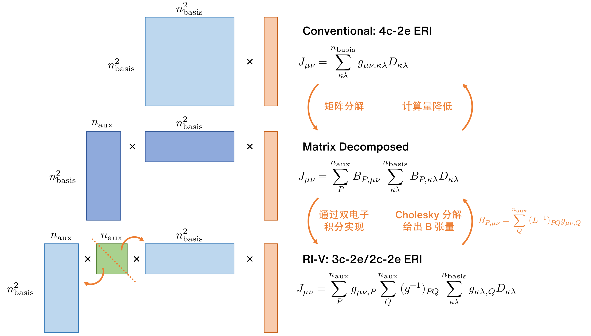

# RI-RHF：极简演示

- 程序：`ri_rhf_slow.rs` ([gitee](https://gitee.com/restgroup/showcase-workshop-rstsr-ricc/blob/master/src/ri_rhf_slow.rs), [github](https://github.com/RESTGroup/showcase-workshop-rstsr-ricc/blob/master/src/ri_rhf_slow.rs))
- 实现内容：RI-RHF (restricted resolution-of-identity Hartree-Fock)
- 不关注程序效率
- 该程序总共约 50 行

在本节中，我们经常将密度矩阵 $D_{\mu \nu}$ 看作 $n_\mathrm{basis}^2$ 长度的 1-D 向量，而非 $n_\mathrm{basis} \times n_\mathrm{basis}$ 的 2-D 矩阵。类似地，4c-2e 双电子积分经常看作是 $n_\mathrm{basis}^2 \times n_\mathrm{basis}^2$ 的 2-D 矩阵，而非 $n_\mathrm{basis} \times n_\mathrm{basis} \times n_\mathrm{basis} \times n_\mathrm{basis}$ 的 4-D 张量。

## 目录

<!-- toc -->

## 1. RI-RHF 回顾

相比于普通的 RHF，RI-RHF 方法不需要计算庞大的 4c-2e 双电子积分，而只需要计算较小的 3c-2e 双电子积分。同时，通过张量分解，其 Fock 矩阵的计算量明显比 RHF 方法小很多。

以 J 积分 $J_{\mu \nu}$ 为例，RI-V 近似下的 RI-RHF 的理解思路可以大致用下图表示：



### 1.1 4c-2e 双电子积分分解

RI-V 近似除了普通的分子轨道基组外，还需要设置辅助基组。辅助基数量越大、精度越高但计算消耗也越多。一般来说，辅助基组的数量 $n_\mathrm{aux}$ 大约是 $3 n_\mathrm{basis}$ 大小。从矩阵分解的角度来看，如果将 4c-2e 双电子积分看作 $n_\mathrm{basis}^2 \times n_\mathrm{basis}^2$ 的矩阵，那么辅助基的大小 $n_\mathrm{aux}$ 数量级上应该要接近 4c-2e 双电子积分的秩 (rank)。

3c-2e 双电子积分与 2c-2e 双电子积分定义如下：

$$
\begin{aligned}
g_{\mu \nu, P} &= \int \mathrm{d} \bm{r}_1 \int \mathrm{d} \bm{r}_2 \, \phi_\mu (\bm{r}_1) \phi_\nu (\bm{r}_1) \frac{1}{|\bm{r}_1 - \bm{r}_2|} \phi_P (\bm{r}_2) \\
g_{PQ} &= \int \mathrm{d} \bm{r}_1 \int \mathrm{d} \bm{r}_2 \, \phi_P (\bm{r}_1) \frac{1}{|\bm{r}_1 - \bm{r}_2|} \phi_Q (\bm{r}_2)
\end{aligned}
$$

随后对 2c-2e 双电子积分作 Cholesky 分解，分解得到的 $L_{PQ}$ 是下三角矩阵：

$$
g_{PQ} = \sum_{L}^{n_\mathrm{aux}} L_{PR} L_{QR} \quad \text{or} \quad \mathbf{g}^\textsf{2c} = \mathbf{L} \mathbf{L}^\dagger
$$

考虑到 4c-2e 双电子积分在 RI-V 下的近似表达式为

$$
\mathbf{g}^\textsf{4c} \simeq \mathbf{g}^\textsf{3c} (\mathbf{g}^\textsf{2c})^{-1} (\mathbf{g}^\textsf{3c})^\dagger = \mathbf{g}^\textsf{3c} (\mathbf{L}^\dagger)^{-1} \mathbf{L}^{-1} (\mathbf{g}^\textsf{3c})^\dagger
$$

定义 Cholesky 分解量 $B_{P, \mu \nu}$ 为 (在我们当前的项目中，需要注意其指标顺序与 3c-2e 双电子积分 $g_{\mu \nu, P}$ 不同)

$$
\mathbf{B} = \mathbf{L}^{-1} (\mathbf{g}^\textsf{3c})^\dagger \quad \text{or} \quad B_{P, \mu \nu} = \sum_{Q}^{n_\mathrm{aux}} (L^{-1})_{PQ} g_{\mu \nu, Q}
$$

那么 4c-2e 双电子积分的近似表达式也可以写为

$$
\mathbf{g}^\textsf{4c} \simeq \mathbf{B}^\dagger \mathbf{B} \quad \text{or} \quad g_{\mu \nu, \kappa \lambda} \simeq \sum_P^{n_\mathrm{aux}} B_{P, \mu \nu} B_{P, \kappa \lambda}
$$

### 1.2 J 积分

J 积分的计算近似为

$$
J_{\mu \nu} = \sum_{\kappa \lambda}^{n_\mathrm{basis}} g_{\mu \nu, \kappa \lambda} D_{\kappa \lambda} \simeq \sum_{P}^{n_\mathrm{aux}} B_{P, \mu \nu} \sum_{\kappa \lambda}^{n_\mathrm{basis}} B_{P, \kappa \lambda} D_{\kappa \lambda}
$$

如果用矩阵-向量乘法来表述，则是

$$
\mathbf{J} \simeq \mathbf{B}^\dagger \mathbf{B} \mathbf{D}
$$

### 1.3 K 积分

在 RI 近似下，K 积分的计算应代入分子轨道系数以提升计算效率。在闭壳层下，占据轨道总是双占据的。

$$
K_{\mu \nu}
= \sum_{\kappa \lambda}^{n_\mathrm{basis}} g_{\mu \kappa, \nu \lambda} D_{\kappa \lambda}
\simeq 2 \sum_{P}^{n_\mathrm{aux}} \sum_{\kappa \lambda}^{n_\mathrm{basis}} \sum_i^{n_\mathrm{occ}} B_{P, \mu \kappa} B_{P, \nu \lambda} C_{\kappa i} C_{\lambda i}
$$

当我们定义半转换 (half-transformed) 的 $B_{P, i \mu}$ 为

$$
B_{P, i \mu} = \sum_{\kappa}^{n_\mathrm{basis}} B_{P, \mu \kappa} C_{\kappa i}
$$

我们可以将 $K_{\mu \nu}$ 进一步写为

$$
K_{\mu \nu} \simeq 2 \sum_{P}^{n_\mathrm{aux}} \sum_i^{n_\mathrm{occ}} B_{P, i \mu} B_{P, i \nu}
$$

我们再定义记号 $\bar{B}_{P i, \mu} = B_{P, i \mu}$，这两个张量完全等价。但当作矩阵看待时，$B_{P, i \mu}$ 是 $n_\mathrm{aux} \times n_\mathrm{occ} n_\mathrm{basis}$ 大小，而 $\bar{B}_{P i, \mu}$ 是 $n_\mathrm{aux} n_\mathrm{occ} \times n_\mathrm{basis}$ 大小。定义 $\bar{B}_{P i, \mu}$ 的方便之处在于，K 积分可以用简单的矩阵乘法形式表达出来 (上标 half 是指该张量是经过半转换的)：

$$
\mathbf{K} \simeq 2 {\mathbf{\bar{B}}^\textsf{half}}^\dagger \mathbf{\bar{B}}^\textsf{half}
$$

## 2. 程序

### 2.1 4c-2e 双电子积分分解

在获得电子积分后，我们的主要目标是得到 $B_{P, \mu \nu}$。总共需要作两步计算：Cholesky 分解与矩阵求解：
$$
\begin{aligned}
\mathbf{g}^\textsf{2c} &= \mathbf{L} \mathbf{L}^\dagger \\
\mathbf{B} &= \mathbf{L}^{-1} (\mathbf{g}^\textsf{3c})^\dagger
\end{aligned}
$$

在程序中的实现如下：
```rust
let int2c2e_l = rt::linalg::cholesky((int2c2e.view(), Lower));
let cderi = rt::linalg::solve_triangular((int2c2e_l.view(), int3c2e.reshape([nao * nao, naux]).t(), Lower));
let cderi = cderi.into_shape([naux, nao, nao]).into_contig(RowMajor);
```

- 关于 Cholesky 分解，代码相信已经很直观了；
- 关于矩阵求解，需要注意到这里的 $\mathbf{L}$ 是下三角矩阵；通过三角矩阵求解函数 `solve_triangular` 会比通常的矩阵求解函数 `solve_general` 或者求逆 `inv` 函数，性能上要快许多。
- 最后，我们对 $B_{P, \mu \nu}$ 作维度修改 (从 $n_\mathrm{aux} \times n_\mathrm{basis}^2$ 的 2-D 矩阵修改到 $n_\mathrm{aux} \times n_\mathrm{basis} \times n_\mathrm{basis}$ 的 3-D 张量)，并从效率角度出发要求该张量需要是 row-major 的 (需要让辅助基指标 $P$ 是最不连续的维度，这在 K 积分计算中是比较关键的)。

### 2.2 J 积分

J 积分的过程非常简单，它就是两次矩阵-向量乘法。但需要注意乘法的顺序，否则效率会非常糟糕：

$$
\mathbf{J} \simeq \mathbf{B}^\dagger (\mathbf{B} \mathbf{D})
$$

```rust
let cderi_flat = cderi.reshape([naux, nao * nao]);
let dm_flat = dm.reshape([nao * nao]);
(cderi_flat.t() % (&cderi_flat % dm_flat)).into_shape([nao, nao])
```
上面的代码花了一些功夫在维度更改上。

### 2.3 K 积分

K 积分的计算是两次矩阵乘法：

$$
\begin{aligned}
B_{P, i \mu} &= \sum_{\kappa}^{n_\mathrm{basis}} B_{P, \mu \kappa} C_{\kappa i} \\
\mathbf{K} &\simeq 2 {\mathbf{\bar{B}}^\textsf{half}}^\dagger \mathbf{\bar{B}}^\textsf{half}
\end{aligned}
$$

```rust
let occ_coeff = mo_coeff.i((.., ..nocc));
let scr = (occ_coeff.t() % cderi.reshape([naux * nao, nao]).t()).into_shape([nocc, naux, nao]);
let scr_flat = scr.reshape([naux * nocc, nao]);
2.0_f64 * (scr_flat.t() % &scr_flat)
```

上述程序的
- 第 1 行是从分子轨道系数中取出占据轨道的部分 $C_{\mu i}$；
- 第 2 行是半转换得到 $B_{i, P \mu}$；
- 第 3 行是重塑维度得到 $\bar{B}_{i P, \mu}$；
- 第 4 行是进行 $\mathbf{K} \simeq 2 {\mathbf{\bar{B}}^\textsf{half}}^\dagger \mathbf{\bar{B}}^\textsf{half}$ 的实际计算。

这里的程序实现与先前 RI-RHF 回顾中用到的公式还有些许差别。我们需要作一些额外的展开。

第 2 行中，我们实际执行的矩阵乘法是

$$
B_{i, P \mu} = \sum_{\kappa}^{n_\mathrm{basis}} C_{\kappa i} B_{P \mu, \kappa}
$$

该矩阵乘法对 $B_{P, \mu \kappa}$ 重塑维度，并对参与乘法的两个矩阵都作转置，才能得到目标结果。这么做非常费劲，其目的是将半转换后指标 $i$ 与 $P$ 联系在一起，方便下面得到矩阵 $K_{\mu \nu}$ 时可以矩阵乘法一步到位。

由于 $\mathbf{K} \simeq 2 {\mathbf{\bar{B}}^\textsf{half}}^\dagger \mathbf{\bar{B}}^\textsf{half}$ 中，指标 $i$ 与 $P$ 是并在一起的；因此半转换得到的是 $B_{i, P \mu}$ 还是 $B_{P, i \mu}$ 并不重要，只要 $i$ 与 $P$ 联系在一起即可。
